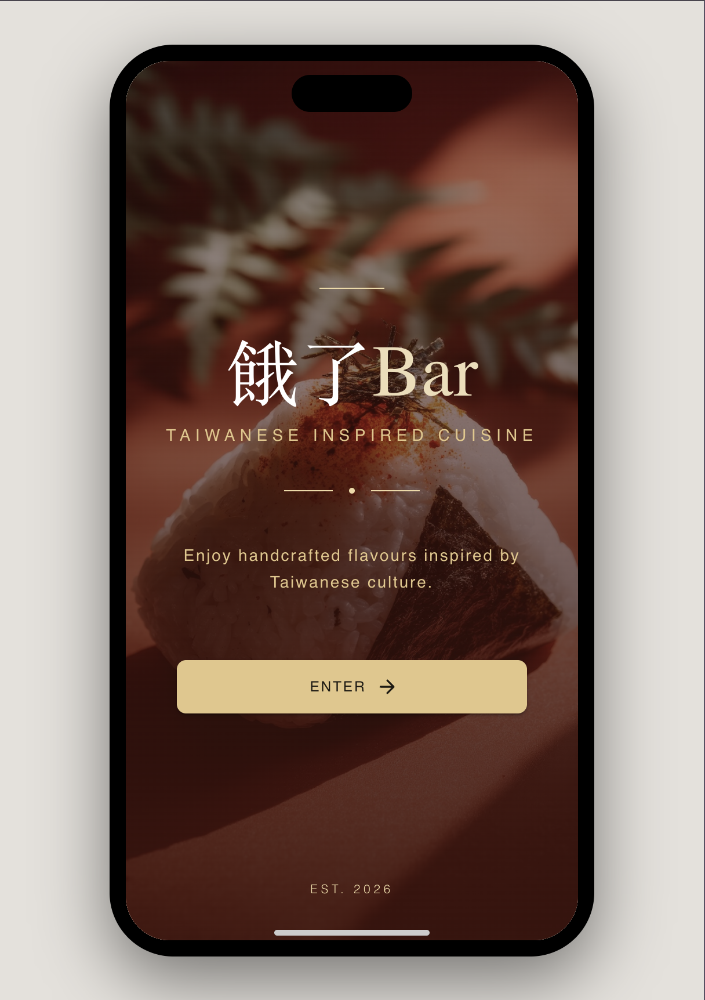
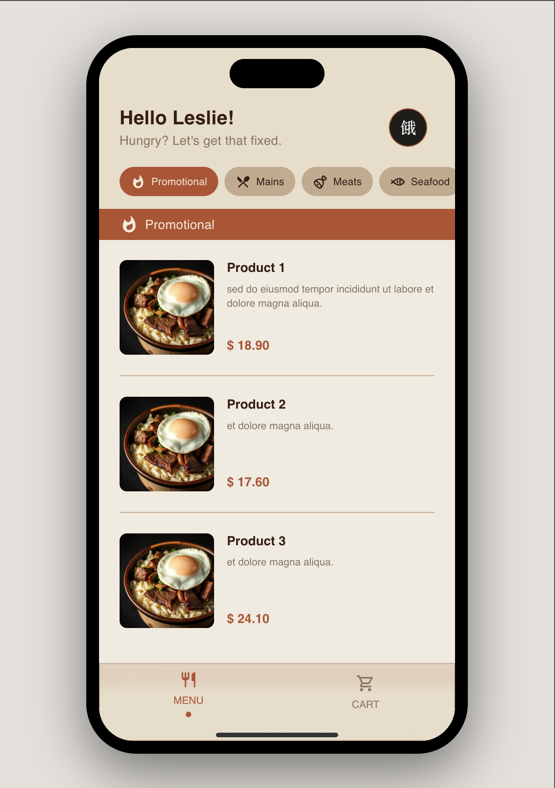
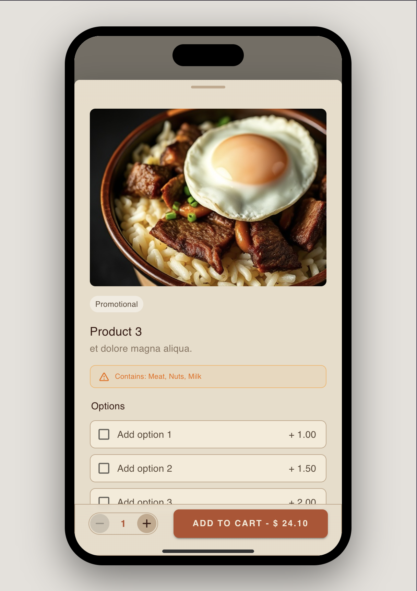
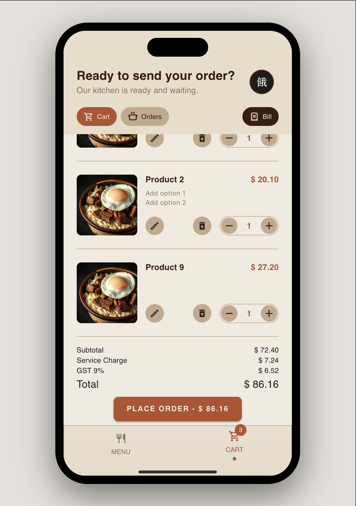
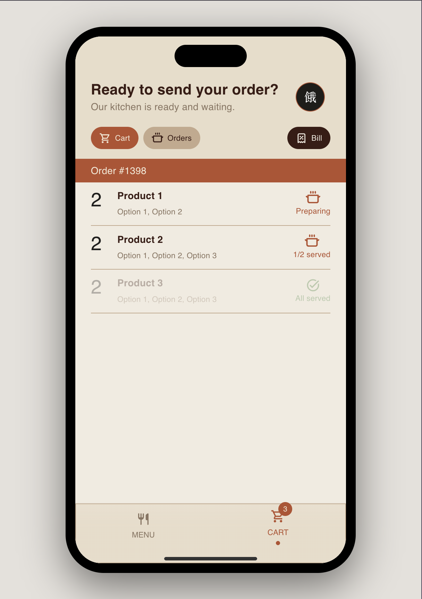

# Project-HungryBar

**HungryBar** is a React-based POS ordering system for on-venue restaurants, covering **front-of-house ordering**, **back-of-house order management**, and **admin inventory management**. The idea came from a conversation with a friend interested in starting a cafe.

## 🚧 Project Status: UI/Code Overhaul in Progress

This project is currently undergoing a full overhaul of both UI and codebase. The Guest (Customer) UI has been rebuilt first, currently running on local dummy data ahead of backend integration. Staff UI has been rebuilt with features to view, accept, complete and also reject orders. Admin UI is next in the pipeline.

## Updated Screenshots (v2 — Guest UI)

| Landing                                      | Menu                                   | Product Details                                              |
| -------------------------------------------- | -------------------------------------- | ------------------------------------------------------------ |
|  |  |  |

| Cart                                   | Orders                                     |
| -------------------------------------- | ------------------------------------------ |
|  |  |

## About HungryBar

HungryBar is an e-commerce style app for managing onsite ordering. Customers browse and order onsite, staff verify orders before sending them to the kitchen, and admins manage the menu.

The app is designed mobile-first for front-of-house (guest) use, and tablet-first for back-of-house (staff) and admin use.

### 3 Separate UIs

- **Guest UI** — public-facing UI for customers to browse and order food.
- **Staff UI** — staff-facing UI to view and manage incoming orders.
- **Admin UI** _(in progress)_ — admin-facing UI for managing products.

All three roles share a single landing page; role-specific paths are separated via login from that landing page.

## Current Features

#### Guest UI (v2 — overhauled)

- Categories bar to quickly jump between menu categories.
- Full menu list with sticky category header.
- Product details view with options.
- Cart with editable item quantities and price summary.
- Order submission and order confirmation view.

#### Staff UI

- View active orders (new and accepted).
- Accept new orders.
- Reject orders.
- Complete orders.
- View completed / rejected orders.

#### Admin UI

- Manage Products: Full CRUD.
- Manage Users: Full CRUD.

## Coming Next: Admin UI

The Admin UI allows the admin role to manage products for the GuestUI and to manage Users on the system (members, staff, admin).

1. Manage products:
   - CRUD for categories management.
   - CRUD for products management.
2. Manage users:
   - CRUD for users management. Admin will be able to Read, Update and Delete Members, and Create, Read, Update, and Delete Staff and Admins.

## The Tech

#### Frontend

- **React with TypeScript** — provides a clear interface between components, though authoring the interface contracts takes more upfront work.
- **MUI (Material UI)** — fast to build with out-of-the-box, but customisation has a steep learning curve and can produce unexpected results.

#### Backend

- **Flask** — a Python micro web framework, chosen to get more familiar with Python. Minimal boilerplate to get started.

#### Database

- **PostgreSQL** — switched from NoSQL to SQL; found SQL statements powerful and the backend logic easier to build on.

## .env Keys

#### Frontend

- `VITE_SERVER`

#### Backend

- `DEBUG`
- `DB`
- `DB_HOST`
- `DB_PASSWORD`
- `DB_PORT`
- `DB_USER`
- `JWT_SECRET_KEY`

## Component Tree (General)

```
└─ App
   ├─ GuestUI
   │ ├─ SplashPage
   │ │  ├─ LoginBox
   │ │  └─ TableNumberBox
   │ │
   │ ├─ GuestHomePage
   │ │  ├─ CategoryBar
   │ │  │
   │ │  ├─ ProductList
   │ │  │  └─ ProductListItem
   │ │  │
   │ │  └─ ProductDetails
   │ │     ├─ ProductOptions
   │ │     └─ SpinButton
   │ │
   │ ├─ CartPage
   │ │  ├─ CartList
   │ │  │  ├─ CartListItem
   │ │  │  └─ CartListItemTotals
   │ │  │
   │ │  └─ CartEmptyBlurb
   │ │
   │ └─ GuestNav
   │
   ├─ StaffUI
   │ ├─ ActiveOrdersPage
   │ │  └─ ContractList
   │ │     ├─ NewOrderListItem
   │ │     └─ AcceptedOrderListItem
   │ │
   │ ├─ OrdersHistoryPage
   │ │  └─ ContractList
   │ │     ├─ CompletedOrderListItem
   │ │     └─ VoidedOrderListItem
   │ │
   │ └─ StaffNav
   │
   └─ AdminUI
```

_Note: component tree will be updated as the UI overhaul progresses._

## Learnings

Early iterations of this project surfaced the importance of proper upfront planning — the original build ran into blockages that came directly from a lack of it. That lesson is driving the current overhaul: replanning the app flow before rebuilding each section, starting with the Guest UI..

## Next Steps

#### Staff

- Manage product statuses (sold out / not available)

#### Guest

- View submitted order history
- Membership and rewards

#### Admin

- Full management of products (products, categories, options)
- Manage users (Customer members, Staff, Admin)
- Manage app settings (notifications)

#### Backend

- Connect overhauled Guest UI to backend (currently running on local dummy data)
